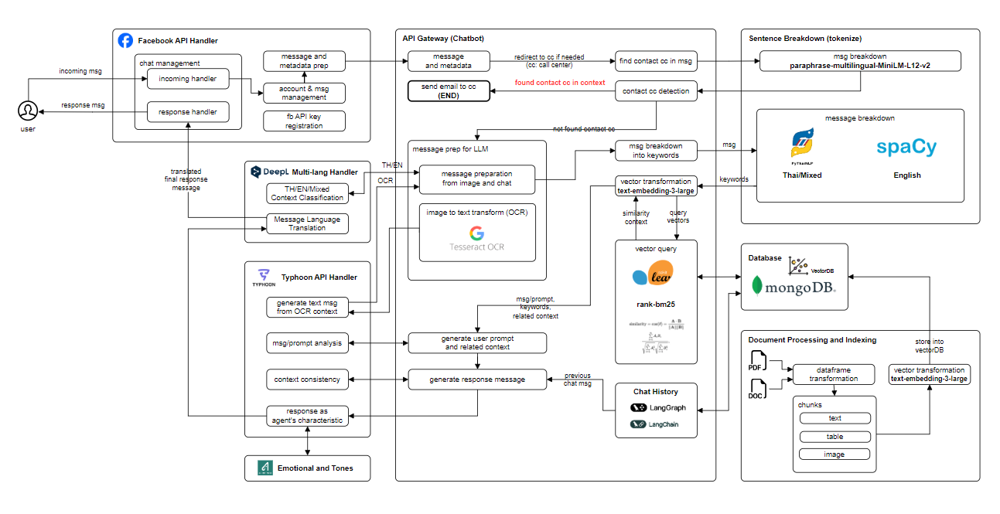

## 🧩 Architecture



## 🧠 Long-Term Memory (LTM) Usage in This Project
This project supports Long-Term Memory (LTM), enabling the AI to “remember” and reference previous conversations or data (e.g., past chats, database entries, or vectorized documents).
This allows the system to deliver more intelligent, context-aware, and continuous responses.

## 💡 What Is LTM?
Long-Term Memory refers to storing important data for long-term use — such as chat histories, text content, references, or embeddings — in databases like MongoDB or Pinecone.
This makes it possible to retrieve and use old information when generating new responses.

## 🛠️ วิธีใช้งาน LTM ในโปรเจกต์นี้
1. Environment Setup
You must configure environment variables correctly (MONGO_URL, PINECONE_API_KEY, etc.).
See the “Getting Started” section below for more details.

2. Core Workflow
When the AI receives a new input (e.g., a user question):

→Retrieve context – The system fetches relevant information from LTM (MongoDB or Pinecone).

→Analyze – The AI uses the retrieved context to understand the current query in relation to past interactions.

→Respond – It generates an answer that’s consistent with previous information or conversations.

3. Example Workflow
Embedding Data

When you upload a file or conversation, the content is embedded and stored in a Vector Store (e.g., Pinecone).

Retrieve Context

When a user asks a question, the system embeds the query and searches for the most similar contexts from the Vector Store or database.

Generate Response

The AI combines the retrieved context with a structured prompt to generate a final answer.

4. ไฟล์โค้ดสำคัญที่เกี่ยวข้อง
embed_MongoDB.py / retrival_MongoDB.py
Manage embedding and retrieval from MongoDB

embed_pinecone.py / retrival_Pinecone.py
Handle embedding and retrieval using Pinecone

Prompt.py
Formats prompts and integrates contextual data for LLM input

## 🐍 Python Version
Python: 3.13.x

## 🚀 Getting Started
🛠️ 1. Create Environment
```python -m venv venv```

📦 2. Install Dependencies
```pip install -r requirements.txt```


🔐 3. Set Environment Variables
Create a .env file inside the venv/ directory and add:

<pre>OPENAI_API_KEY=your_openai_api_key
MONGO_URL=your_localhost_or_remote_url
PINECONE_API_KEY=your_pinecone_api_key
PINECONE_ENV=your_pinecone_environment
EMBEDDING=embedding_model_name_from_openai
FACEBOOK_ACCESS_TOKEN = TOKEN_API_FACEBOOK
HF_TOKEN=your_huggingface_token
TYPHOON_API_KEY=your_key
TYPHOON_API_URL=https://api.opentyphoon.ai/v1
</pre>

You can get your Typhoon API key from https://playground.opentyphoon.ai/api-key

## 📄 Required File: data.json (in main_backend/)
Example:
<pre>
[
  {
    "question": "เมลนิสิตของหนูมีปัญหาไม่สามารถเข้าใช้งานได้ค่ะ",
    "answer": "กรณีรหัสผ่านหมดอายุหรือถูกระงับบัญชี สามารถเข้าไปแก้ได้ตาม Link นี้ ***"
  },
  {
    "question": "อยากทราบวิธีการสมัครเข้าเรียนต่อมหาวิทยาลัยค่ะ",
    "answer": "สามารถดูรายละเอียดการสมัครได้ที่ Link นี้ "
  }]
</pre>

## 🧪 Running the Project
▶️ Run Backend (FastAPI)
```cd main_backend```

```uvicorn main:app --host 0.0.0.0 --port 8000 --reload```

## 🖼️ Run Frontend (Streamlit) That is Optional for Test
Open a new terminal:
```cd frontend```

```streamlit run app.py```

## 🖼️ 🧩 Run Frontend Prototype (Prototype)
```cd frontend```

```npm run dev```

## 🛠️ Common Issues & Fixes
🔄 Update or Reinstall Packages
If you face issues with transformers or torchvision:
```pip uninstall transformers torchvision```

```pip install transformers torchvision```

## ⚙️ Fix IProgress / Jupyter Issues
```pip install ipywidgets```

```jupyter nbextension enable --py widgetsnbextension```

## 🔥 Upgrade PyTorch
ตรวจสอบเวอร์ชันล่าสุดและแก้ไขของ torch:
```pip install torch --upgrade```

##  📚 Missing Libraries
If an error indicates a missing library:
```pip install <library_name>```

## 🐳 Run with Docker
```docker run -d -p 5000:5000 -e OPENAI_API_KEY="your-openai-api-key-here" chatbot_ai_platform```

## Don't forget ! 🧠 Install NLP Models (for English)
```python -m spacy download en_core_web_sm```

## 🙋‍♂️ Contact
If you encounter bugs or have suggestions, please open an Issue or submit a Pull Request.

